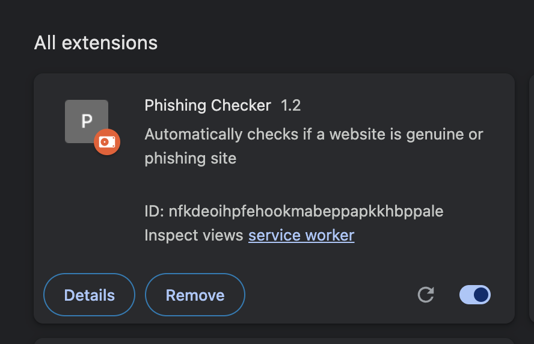
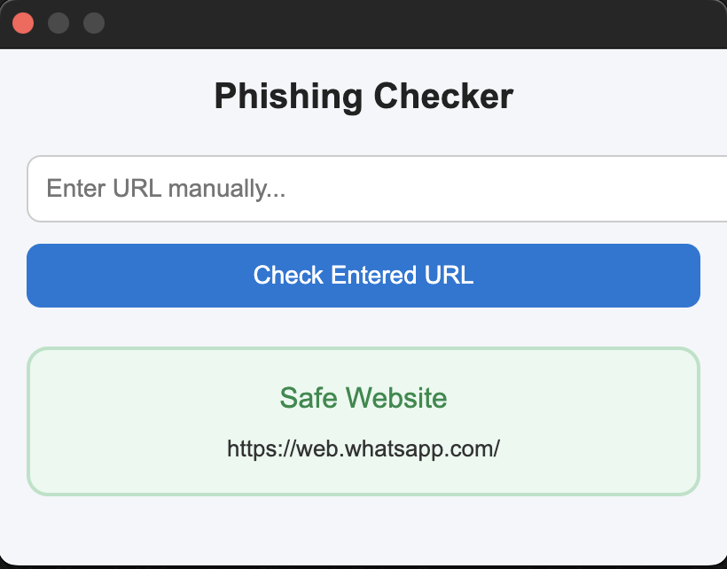
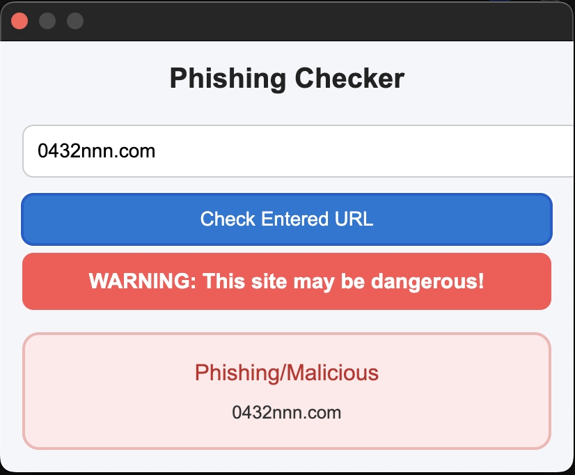

# 🔎 Phishing Website Checker - Chrome Extension

A lightweight Chrome extension that automatically checks whether the website you are visiting is **Safe** or **Phishing/Malicious**.
It runs seamlessly in the background and updates results every time you open or switch a website.

---

## ✨ Features

- ✅ **Automatic URL Check** – No clicks required, the extension fetches results for the current tab.
- 🌐 **External URL Check** – Enter any URL manually to verify its safety.
- ⚡ **Real-time Updates** – Instantly re-checks when you change websites.
- 🎨 **Clean & Modern Popup UI** – Easy to understand, beginner-friendly results.
- 🔒 **Privacy First** – No data is stored or tracked; only the URL being checked is sent to the API.

---

## 📸 Preview







---

## 🚀 Installation

1. Clone or download this repository.
2. Open Google Chrome and go to:
   - `chrome://extensions/`
3. Enable **Developer mode** (top-right).
4. Click **Load unpacked**.
5. Select the project folder containing `manifest.json`.

The extension will now appear in your browser toolbar.

---

## 🛠️ Tech Stack

- Manifest V3 (latest Chrome Extension API)
- JavaScript / HTML / CSS
- Background & Popup Scripts
- External API for Phishing Detection

---

## ⚡ Usage

- Open any website → The extension will automatically check if it’s safe or phishing.
- Want to check a custom website? → Just enter the URL in the popup.
- Results instantly show in the popup window.

---

## 📂 Project Structure

```
phishing-checker-extension/
│── manifest.json        # Extension config
│── background.js        # Runs checks in background
│── popup.html           # User interface
│── popup.js             # Logic for popup UI
│── styles.css           # Styling
│── icons/               # Extension icons
```

---

## 📌 Future Improvements

- 🔄 Auto-refresh results without reopening popup.
- 🛡️ Integrate multiple security APIs for stronger detection.
- 📊 Show risk level (Low, Medium, High).
- 🌍 Multi-language support.

---

## ⚠️ Disclaimer

This extension is built for educational and security research purposes only.
Always verify websites carefully before entering personal information.